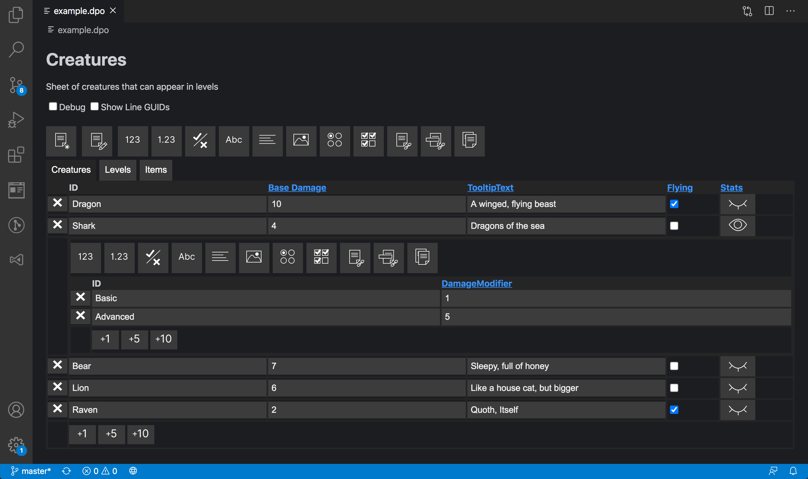

# Depot
**Depot** is a structured data editor for Visual Studio Code that leverages Code's Custom Editor API to allow you to edit JSON data like a spreadsheet. Data you would normally store in raw JSON or XML can instead be stored, edited, and managed, all through a _single_ Depot file.

### Requirements
* Visual Studio Code 1.48+

[Download as a Visual Studio Code Extension Here](https://marketplace.visualstudio.com/items?itemName=afterschool.depot)

[](https://github.com/sponsors/afterschoolstudio)

## Features
* Edit data normally stored as raw JSON in a spreadsheet style interface
* A Depot file contains its data model, making the file itself portable to any other program
* Because the file uses JSON with newlines, you can easily track changes to data values or the model itself through source control



## Sponsor

If you use or find value in Depot, we'd love it if you could sponsor the project! Click the link below or [navigate here](https://github.com/sponsors/afterschoolstudio) to choose a tier to support this project at.

[](https://github.com/sponsors/afterschoolstudio)

## Quickstart

[Watch an overview video here](https://www.youtube.com/watch?v=tCTQvd3zkEg)

1. Install Depot as an extension in VS Code or through the [Visual Studio Marketplace](https://marketplace.visualstudio.com/items?itemName=afterschool.depot)
2. Once installed, use the "Create a new Depot file" command to create a new Depot file in your workspace.
3. Click on the file, create a new sheet, and start working!

You can also manually create a Depot file by creating a file with this as its contents and giving it a ```.dpo``` extension:

```
{
    "sheets":[]
}
```

Note that once Depot is installed, the extension will try to open any file with ```.dpo``` through the Depot editor. If you want to manually create a Depot file, I suggest creating the file as a ```.txt``` file, adding the above contents, then changing the file's extension to ```.dpo```.

### Custom File Extensions
You can also use a custom file extension for Depot by editing your ```settings.json``` file and adding the following line:

### For most recent Code Versions

```
{
    "workbench.editorAssociations": {
        "*.foo" : "depot.data",
        "*.bar" : "depot.data"
    }
}
```


### For Code Versions Before 1.56

```
"workbench.editorAssociations": [
    {
        "viewType": "depot.data",
        "filenamePattern": "*.foo"
    },
    {
        "viewType": "depot.data",
        "filenamePattern": "*.bar"
    }
]
```

In the above example, clicking on a file with ```.foo``` or ```.bar``` would also open that file for editing in Depot.

### Other Extension Settings

```depot.defaults.newFileName``` allows you to set the default name for a new Depot file created through the Command Palette command.

## About / Why

Depot is meant as a way to allow people to edit data for their applications and programs in a manner that is common for data editing (spreadsheets) but also structured and indexable (JSON).

A Depot file is special because it contains not only its data, but also stores its data model inside itself. This means any given Depot file can be loaded and used anywhere, as the file itself contains the instructions for reading it. This also means the file can perform validation of itself at edit time, making sure that variables are within defined ranges or point to other valid sheets and lines.

Additionally, because Depot uses JSON with newlines, your data can be easily versioned through things like Git. Any changes to the data model or data itself will be reflected in the Depot file, with the same accuracy as normal source control.

Lastly, Depot could not exist without the work done by Nicholas Canasse on [CastleDB](https://github.com/ncannasse/castle). Depot is heavily inspired by CastleDB, but with the goal of bringing structed data editing to the IDE itself instead of needing to use another program. If you're familiar with CastleDB, you can [read more about the similarites and differences between it and Depot here](https://github.com/kkukshtel/Depot/wiki/Depot-vs.-CastleDB).

## Under the hood

A Depot file (```.dpo```) is just JSON, but unlike normal JSON it's organized through Sheets, Lines, and Columns.

### Sheets

[Read more about sheets on the wiki here](https://github.com/kkukshtel/Depot/wiki/Depot-Sheet-Information)

At the highest level, a Depot file consists of some number of sheets. These sheets are invididual collections of structured data, with the added benefit that they can also reference each other.

### Lines

A given sheet also has some number of lines. You can think of a sheet's lines as entries in the database defined by the sheet. Lines have data based on what columns are in the sheet it is a part of.

### Columns

[For a deeper dive on columns and their types, click here](https://github.com/kkukshtel/Depot/wiki/Depot-Column-Information)

Columns define the fields of a sheet that a line can have data for. Columns can be specific primitive types (```string```, ```bool```, ```int```, etc.), but can also be other special types unique to Depot:

|Type|Icon|Description|Storage Type|Default Value|
|---|---|---|---|---|
| GUID | None | A generated GUID for the given line. These cannot be edited. | String value | guid as string |
| ID | None | The ID of a column. These are ideally unique, and Depot will warn you if you duplicate the value. | String value | index in sheet as string |
| Text |  | A standard line of text. | String value | `""` |
| Long Text |  | Longer line of text. These fields can be resized in the editor. | String Value | `""` |
| Float |  | Any number | Number value | `0` |
| Int |  | Integer number | Number value | `0` |
| Bool |  | True / False boolean value. | true or false | `true` |
| Image |  | Path to an image relative to the location of the Depot file (displayed in the sheet) | String relative path to the image | `""` |
| Single Select |  | Exclusive choice between a set number of choices | String value | `""` |
| Multi Select |  | Several choices between a set number of choices | Array of selected values as strings | `` |
| Line Reference |  | A reference to a line in a sheet in the current Depot file | String GUID of selected line | `""` |
| Sheet Reference |  | A reference to a sheet in the current Depot file | String GUID of selected sheet | `""` |
| List |  | An array of structured data | Array of structured values | `[]` |
| File |  | Path to a file relative to the location of the Depot file (displayed in the sheet) | String relative path to the image | `""` |
| Properties |  | This is a top level JSON object that allows you to specify properties for lines and index them directly from a line instead of needing to use an array. | JSON Object | `{}` |
| Grid |  | This is a top level Array object that allows you to specify an array of values and index them directly from a line instead of needing to use a list on entries. | Array | `[true,true,true,true]` |

## Wiki
For more in-depth documentation on Depot, [you can read the wiki here](https://github.com/kkukshtel/Depot/wiki).

## Edge Cases

* When the sheet a line reference field references is deleted, the line value goes to "", the default values are cleared, and the sheet is reset to "".
* When the linw a line reference field references is deleted the lines that pointed to that line get their linked value set to "". Defaults that pointed to that get pointed to ""
* If the sheet column is modified for a line reference field, the defaults and values stay as their old values but display an error that they link to an unreachable value

## Release Notes

Read the [Changelog](./CHANGELOG.md) for older versions and minor releases

### 1.5.0

- Quality of Life updates
  - Nested sheets (from Lists + Props) will now only display their Add Column UI when that specific table is hovered, cleaning up the general UI of Depot and making it more understandable at a glance
  - Added in toggle for nested sheet data previewing so it isn't always on by default
  - Added in ability for a nested sheet to display its name (toggleable from options)
  - Added in ability for a nested sheet to display its path (toggleable from options)
  - These last two changes make it much easier to know what data you are editing in what nested sheet. This also paves the way to the idea of "focusing" a given sheet in a structure so you don't have to look at the whole sheet all the time.
  - Added in ability to "lock"/"unlock" a Depot file ("Allow Schema Editing" option) to locally "lock-in" the structure of a file. This can be toggled on and off at will and is not saved to the depot file directly.
  - Added in ability to prevent entries in a list or property field from being added or removed ("Add/Remove Items" option).
  - Image previews pop out in a tooltip when hovered instead of expanding inline.

---

## Attribution

Image samples in the example folder are from [game-icons.net](https://game-icons.net/) under the [CC BY 3.0](https://creativecommons.org/licenses/by/3.0/) license
